# DevSummit URL Shortener

A fully serverless URL shortener built for a tech conference scenario where speakers need branded short links for their talk resources.

---

## The Problem

Speakers at DevSummit share resource links during talks, but long URLs on slides are unreadable. This system allows organizers to generate short, memorable links that attendees can easily type or scan via QR codes.

---

## Architecture

This system follows a fully serverless, event-driven design with two main flows:

## Architecture Diagram
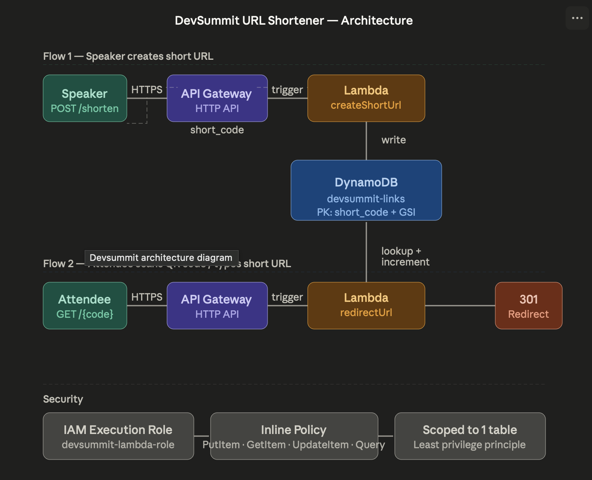

---

## Design Tradeoffs

- Chose DynamoDB over relational DB for low-latency key-value lookups
- Used Lambda for stateless scaling and cost efficiency
- API Gateway provides managed routing and throttling
- 301 redirects chosen for permanent SEO-friendly links
- GSI used to enable reverse lookup of original URLs

---

### Flow 1 — Create Short URL
POST /shorten  
→ API Gateway  
→ Lambda (createShortUrl)  
→ DynamoDB (store mapping)

### Flow 2 — Redirect User
GET /{code}  
→ API Gateway  
→ Lambda (redirectUrl)  
→ DynamoDB (lookup)  
→ 301 Redirect response

---
## Design Decisions

- DynamoDB was chosen for low-latency key-value lookups and automatic scaling
- Lambda provides a fully serverless, event-driven compute layer with no infrastructure management
- API Gateway acts as a managed HTTP entry point for both create and redirect flows
- 301 redirects are used for permanent, SEO-friendly URL forwarding
- A Global Secondary Index (GSI) enables reverse lookup to prevent duplicate URL entries

## AWS Services Used

| Service | Purpose |
|---|---|
| AWS Lambda | Serverless compute for create and redirect logic |
| API Gateway | HTTP API exposing POST /shorten and GET /{code} |
| DynamoDB | NoSQL database storing URL mappings and click counts |
| IAM | Scoped execution role with least privilege access |

---

## Features

- Create short codes from long URLs  
- Instant 301 redirects with millisecond DynamoDB lookups  
- Atomic click counter per link  
- Duplicate URL detection via GSI reverse lookup  
- Least privilege IAM role scoped to one table  

---

## How to Test

### 1. Create a short URL
Send a POST request to `/shorten`:

POST /shorten
{
  "url": "https://aws.amazon.com/lambda/"
}

### 2. Get response
You will receive a short code:

{
  "shortUrl": "https://your-api.com/abc123"
}

### 3. Test redirect
Open the short URL in browser:

https://your-api.com/abc123

You should be redirected (301) to the original URL.

## Screenshots

### DynamoDB Setup
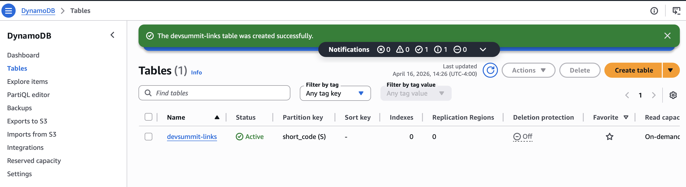  
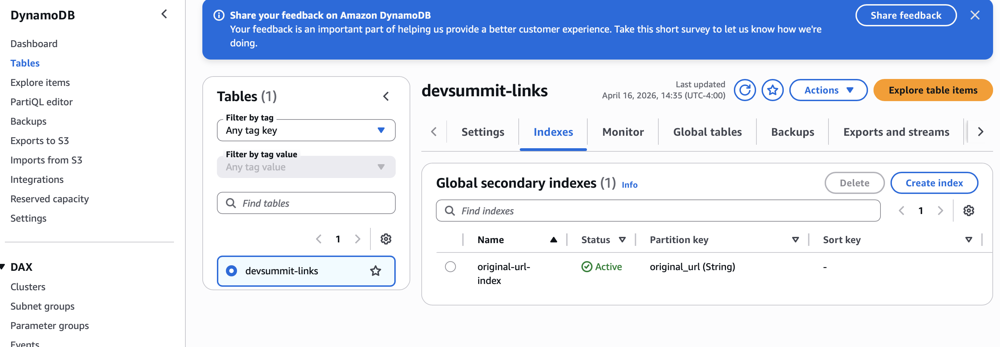

### Lambda Functions
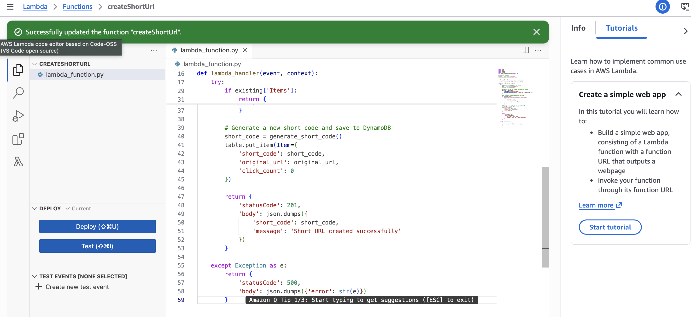
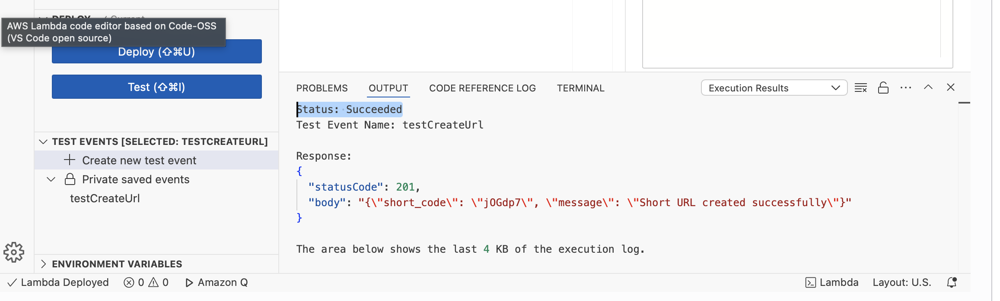
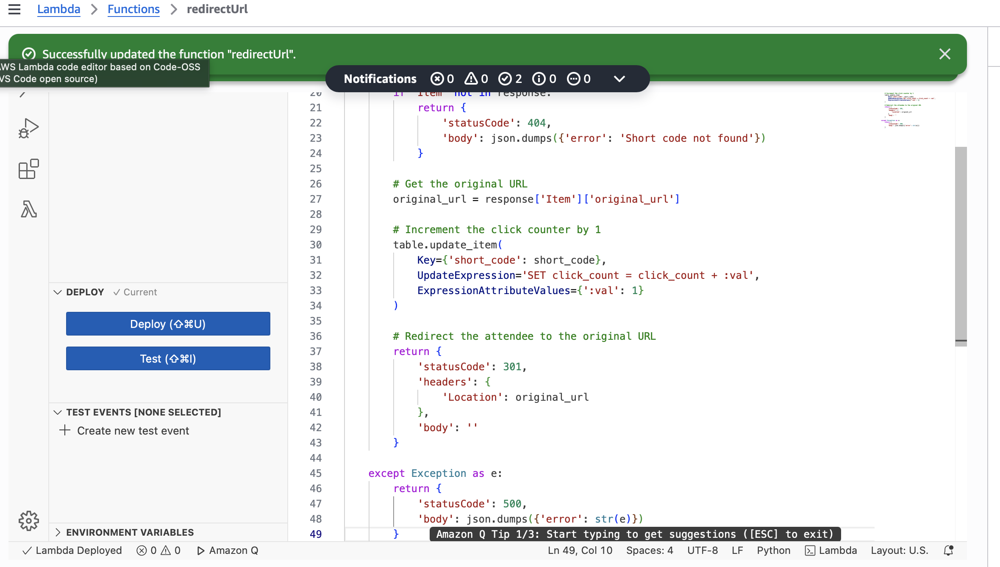

### API Gateway
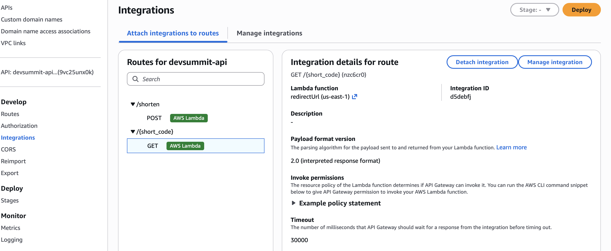
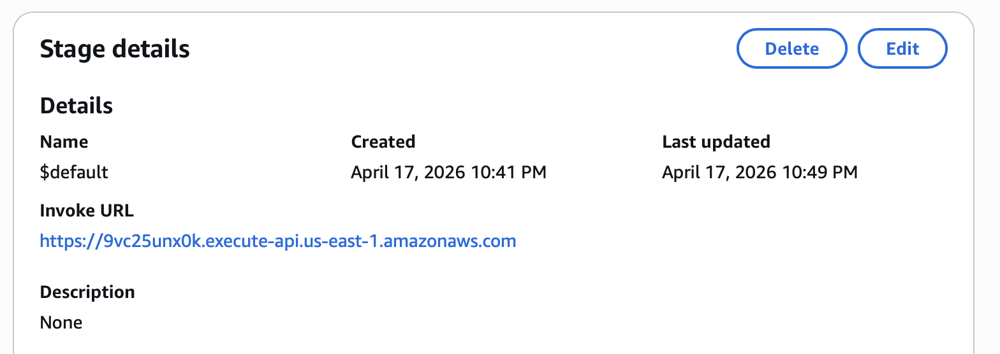 

### End-to-End Test
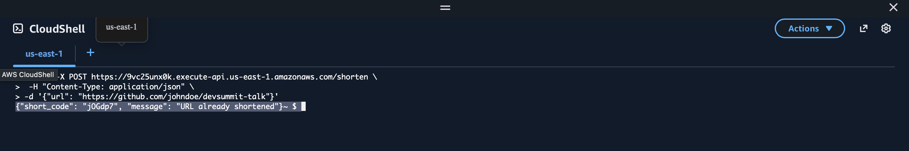
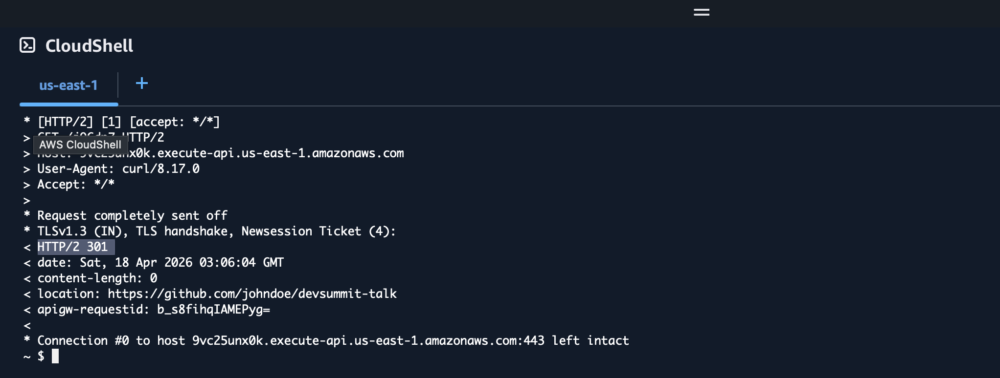

### Click Tracking
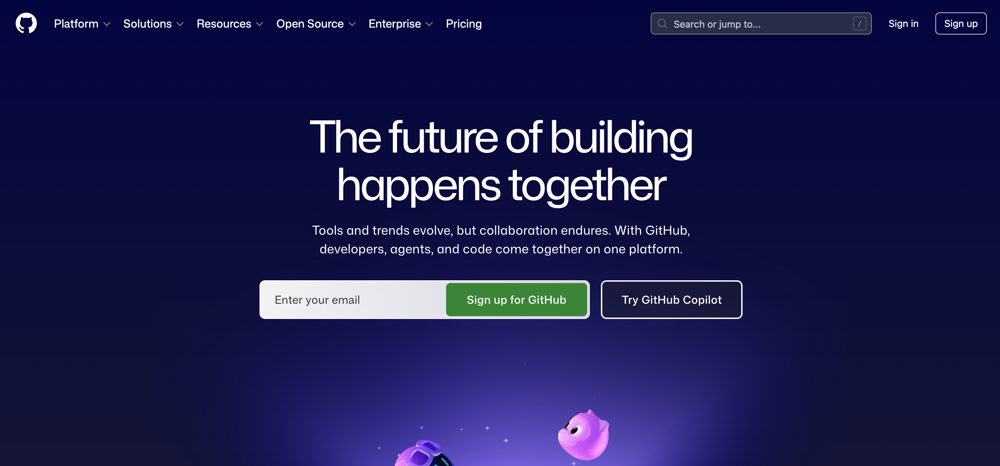 
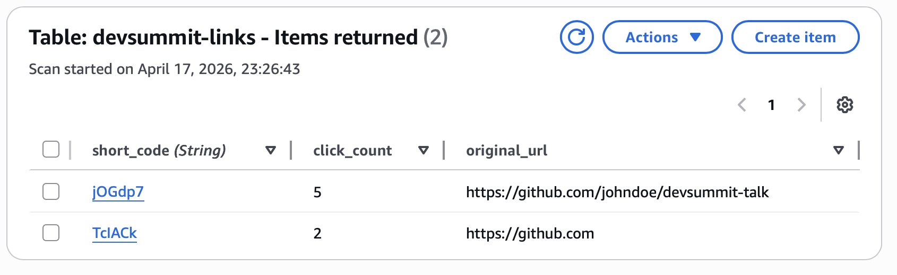 

---

## What I Learned

- Designing stateless serverless architectures using AWS Lambda  
- Structuring DynamoDB for both primary access and reverse lookups (GSI)  
- Implementing efficient redirects with minimal latency  
- Applying least-privilege IAM policies in real-world scenarios  
- Building production-style APIs using API Gateway  

---

## Future Improvements

- Add custom domain (Route 53 + CloudFront)  
- Implement rate limiting & abuse protection  
- Add authentication for link creation  
- Build an analytics dashboard for link performance  
